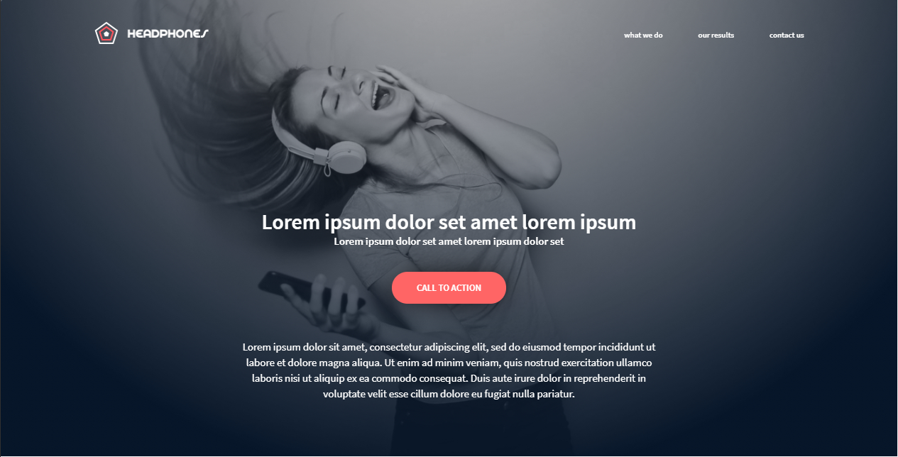
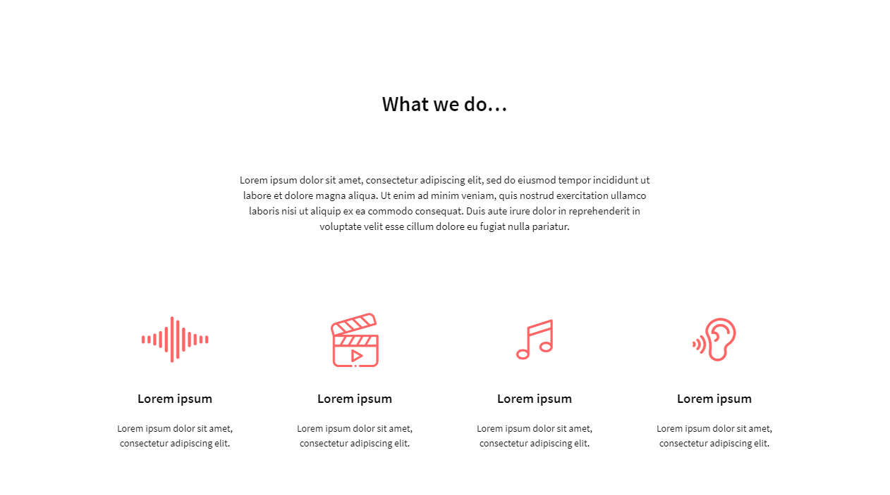
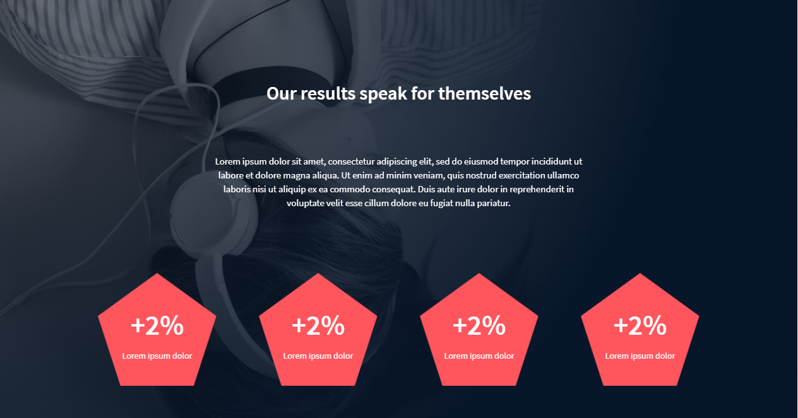
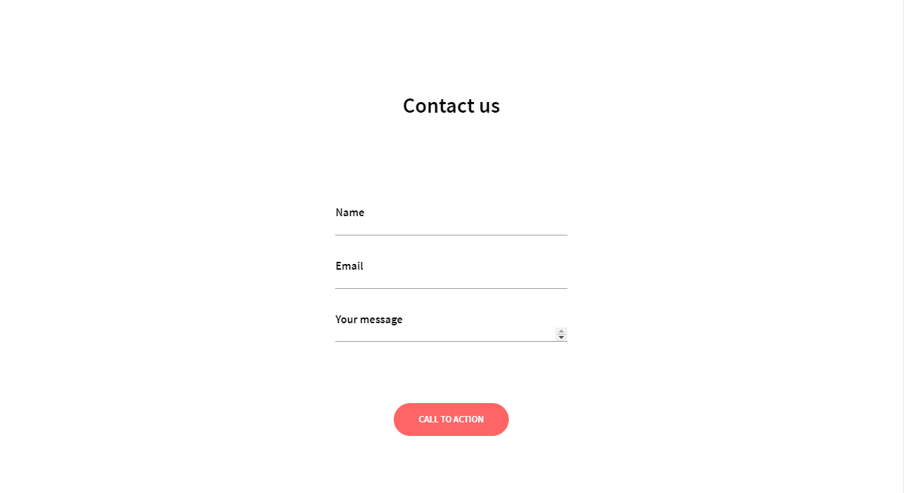
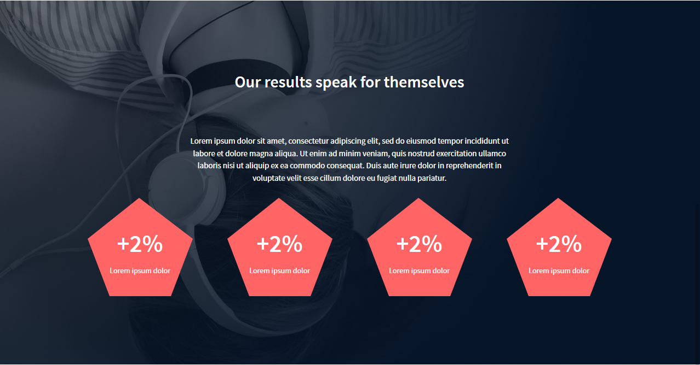
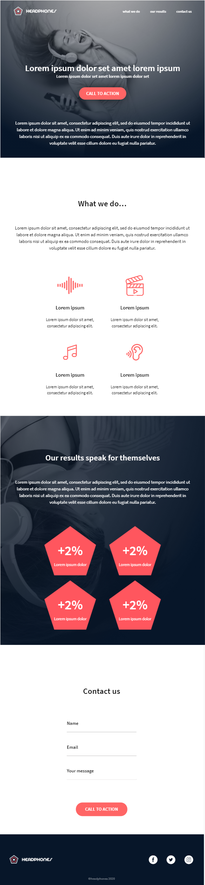

## Description

Creation from scratch, without a library, of a web page. It uses all the knowledge of HTML, CSS, Accessibility and Responsive Design previously learned.

---
## Content
#### 1. Create the header/hero piece --> [HTML file](./0-index.html) - [CSS file](./0-styles.css)

#### 2. Create the "What we do…" section --> [HTML file](./1-index.html) - [CSS file](./1-styles.css)

#### 3. Create the "Our results" section --> [HTML file](./2-index.html) - [CSS file](./2-styles.css)

#### 4. Create the "Contact us" section --> [HTML file](./3-index.html) - [CSS file](./3-styles.css)

#### 5. Create the Footer piece --> [HTML file](./4-index.html) - [CSS file](./4-styles.css)

# Advanced task
#### 6. Replace image by... code! --> [HTML file](./100-index.html) - [CSS file](./100-styles.css)

# Responsive desing
Rendering on screen of **max-width: 767px.**

Rendering on screen of **max-width: 480px.**

---

## Author
#### Luz Sánchez Bolaños
- Github: [zulsb](https://github.com/zulsb)
- Twitter: [@LuzSanchezB](https://twitter.com/LuzSanchezB)

Cohort 10 | Cali, Colombia 2020
